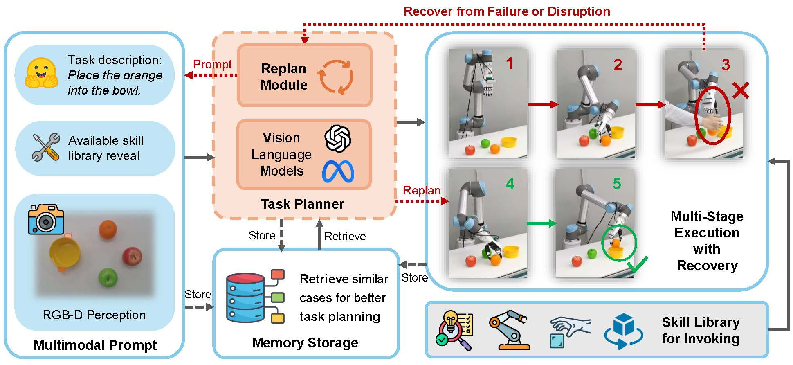

# RoboDexVLM

## Overview


This project is **RoboDexVLM**, which is a VLM-enabled task planner for dexterous manipulation. It is equipped with a VLM task planner with a replan module, a skill library, and a memory module, ensuring the robustness and adaptability of long-horizon open-vocabulary tasks.

Video link: coming soon

Arxiv: coming soon

## Installation
### System requirement
- ROS noetic (Ubuntu 20.04)
- Anaconda3
- GPU with memory no less than 8G
### Dependency
You need to install langSAM and AnyGrasp for detection and grasp pose generation.

**NOTE**: The utilized open-world object segmentation method depends on python 3.11 or higher, while ROS noetic depends on python 3.8 or lower. 

That means that you need at least 2 Anaconda environments. Using socket for communication during execution.

- Install langSAM in the environment with python 3.11.
```
git clone https://github.com/luca-medeiros/lang-segment-anything.git
```
- Install AnyGrasp in the environment with python 3.8.
- **NOTE**: AnyGrasp is not open source, you need to contact the author for the license. See more details in its README.md.
```
git clone https://github.com/graspnet/anygrasp_sdk.git
```
- Install other dependencies (ROS, robot driver, RealSense driver) in the environment with python 3.8.


## Usage

### On lower computer connected to robot

- Enable your robotic arm and dexterous hand
- Publish calibration matrix that you measured
- Ready to convert received pose and move to it

### on upper computer for planning and perception

- Open dexterous grasp perception server, and enable task planner

```    
cd scripts

conda activate py311
python langsam_server.py

conda activate py38
python ros_bridge_server.py
rosrun grasp grasp_pose_server.py
python planner.py
```

- Send question to VLM, generate and publish sub-task sequence
```
python planner_client.py
```


